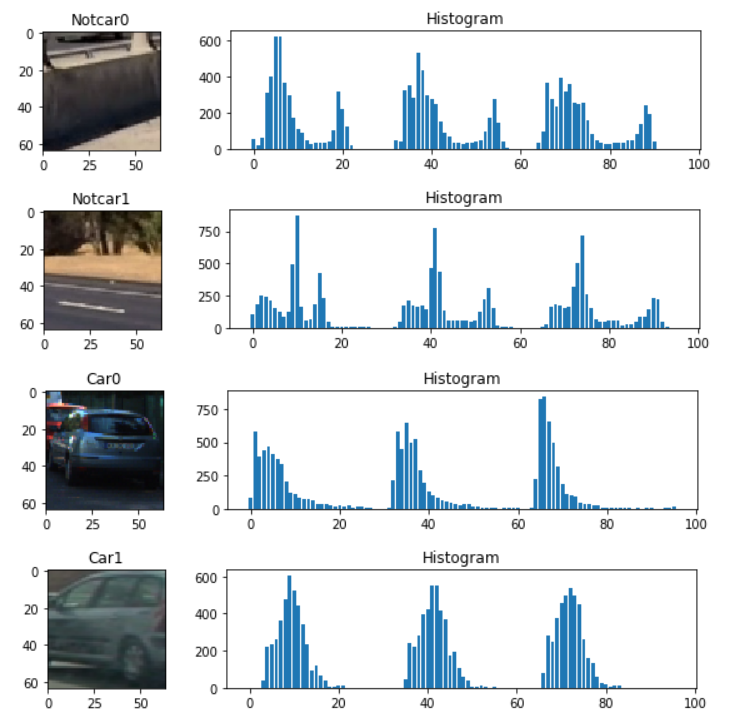
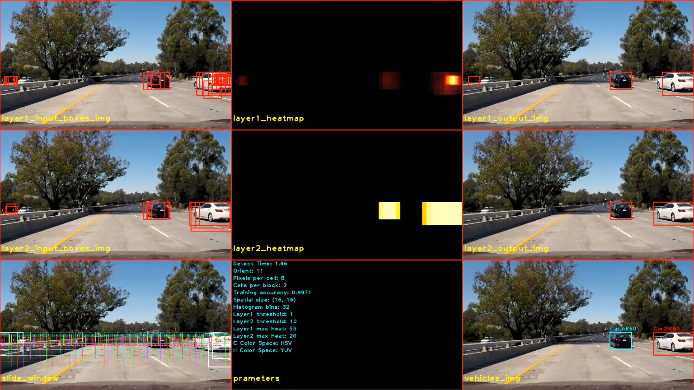

# Vehicle Detection and Tracking

The goals / steps of this project are the following:

* Perform a Histogram of Oriented Gradients (HOG) feature extraction on a labeled training set of images and train a classifier Linear SVM classifier
* Optionally, you can also apply a color transform and append binned color features, as well as histograms of color, to your HOG feature vector. 
* Note: for those first two steps don't forget to normalize your features and randomize a selection for training and testing.
* Implement a sliding-window technique and use your trained classifier to search for vehicles in images.
* Run your pipeline on a video stream (start with the test_video.mp4 and later implement on full project_video.mp4) and create a heat map of recurring detections frame by frame to reject outliers and follow detected vehicles.
* Estimate a bounding box for vehicles detected.

**Here I will consider the [Rubric](https://review.udacity.com/#!/rubrics/513/view) Points individually and describe how I addressed each point in my implementation**.

---

# Project Description

## 1. Submission Files

My project has two parts, the first is Advanced Lane Finding which come from project 4 in CarND-Advanced-Lane-Lines folder. I extract useful interface to P4.py. The second is Vehicle Detection in CarND-Vehicle-Detection folder, I also extract useful interface to P5.py. The top entry.py is the P4 and P5 combination entrance. The main.py of each folder is their entrance respectively.


| CarND-Vehicle-Detection Folder Files            |     Description                                       |
|:-----------------------------------------------:|:-----------------------------------------------------:|
|main.py                                          |entry, configure video, read and write frame, GUI      |
|extract.py                                       |features extract                                       |
|tracker.py                                       |all filters and heatmap                                |
|train.py                                         |training parameters and classifier                     |
|utils.py                                         |some draw image and text functions                     |
|P5.py                                            |P5 interface for combinating with P4                   |
|README.md                                        |summarizing the results                                |
|carnd-p5-env.yml                                 |conda environment                                      |
|video_output                                     |all project and debug video output                     |
|writeup_res                                      |writeup resource                                       |
|modle.p                                          |trained classifier mode                                |


## 2. Feature Extraction

### 2.1. Data Exploration

I used project provided dataset as the training data at first, but after a variety of comparison and testing, I found the classifier is very sensitive to the yellow lane line. I noticed the data of non-vehicles/GTI folder are not captured from this video, I thought these data have much effect on the classifier of this project, so I only use the data of non-vehicles/Extras folder as the not car data. In fact, my guess is correct, the effect of classifier has been significantly improved. Although these data are unbalanced, the accuracy of the classifier is somewhat unreliable, but it is undeniable that I have obtained a more effective classifier for this project. Finally, I got a accuracy **99.63%**. Next, I will detail my steps.


Dataset Quantity.

|   Cars     |   Not Cars |   Shape    |
|:----------:|:----------:|:----------:|
| 8792       |      5068  | (64x64x3)  |

### 2.2. Histogram of Oriented Gradients (HOG) Features

I use YUV color space with all channels, 11 orientations, 8 pixel per cell and 2 cells per block at last.

**File**: extract.py

**Input**: original image

**Output**: hog features

```python
    def get_hog_features(self, img, vis=False, feature_vec=True):
        # Call with two outputs if vis==True
        if vis == True:
            features, hog_image = hog(img, orientations=self.orient,
                                      pixels_per_cell=(self.pix_per_cell, self.pix_per_cell),
                                      cells_per_block=(self.cell_per_block, self.cell_per_block),
                                      block_norm='L2-Hys',
                                      transform_sqrt=True,
                                      visualise=vis, feature_vector=feature_vec)
            return features, hog_image
        # Otherwise call with one output
        else:
            features = hog(img, orientations=self.orient,
                           pixels_per_cell=(self.pix_per_cell, self.pix_per_cell),
                           cells_per_block=(self.cell_per_block, self.cell_per_block),
                           block_norm='L2-Hys',
                           transform_sqrt=True,
                           visualise=vis, feature_vector=feature_vec)
            return features
```


### 2.3. Spatial Color Features

I resize the image to (16, 16), and flatten to a 1-D vector simply at last.

**File**: extract.py

**Input**: original image, shape size

**Output**: spatial binning color features

```python
    def bin_spatial(self, img, size=(32, 32)):
        features = cv2.resize(img, size).ravel()
        return features
```

### 2.4. Color Histogram Features

I didn't use numpy.histogram here, because it's very slow compared with cv2.calcHist. This help me save about 1.3s at last.

**File**: extract.py

**Input**: original image

**Output**: color histogram features

```python
    def color_hist(self, img, nbins=32, bins_range=(0, 256)):
        channel1_hist = cv2.calcHist([img], [0], None, [nbins], bins_range).ravel()
        channel2_hist = cv2.calcHist([img], [1], None, [nbins], bins_range).ravel()
        channel3_hist = cv2.calcHist([img], [2], None, [nbins], bins_range).ravel()
        hist_features = np.concatenate((channel1_hist, channel2_hist, channel3_hist))
        return hist_features
```



### 2.5. Features Selection

I use the simplest LinearSVC() as classifier, because it's fast for testing. After a lot of testing, I think this classifier is good enough.

I use the following steps to find the best combination and parameter configuration

**Step1**: Explore spatial size. To avoid randomness, I chose two color space as a contrast. 
**Win**: (16, 16)

| spatial size    | feature vector length | YUV <br> accuracy | YCrCb <br> accuracy |
|:---------------:|:---------------------:|:-----------------:|:-------------------:|
| (8,  8)         | 192                   | 0.9118            | 0.9168              |
|**(16, 16) Win!**| 768                   | 0.9261            | 0.9394              |
| (32, 32)        | 3072                  | 0.9089            | 0.9229              |

**Step2**: Explore histogram bins. To avoid randomness, I also chose two color space as a contrast. 
**Win**: 32

|histogram bins| feature vector length | YUV <br> accuracy | YCrCb <br> accuracy |
|:------------:|:---------------------:|:-----------------:|:-------------------:|
| 8            | 24                    | 0.9494            | 0.9627              |
| 16           | 48                    | 0.9745            | 0.9792              |
| **32 Win!**  | 96                    | 0.9953            | 0.9953              |

**Step3**: Explore color space. I use both spatial(size=(16, 16)) and histogram(bins=32) features for testing. To avoid randomness, I test 3 sets every color space. 
**Win**: HSV

|histogram + spatial |  RGB <br> accuracy | HLS <br> accuracy |  **HSV Win!** <br> accuracy | YCrCb <br> accuracy | YUV <br> accuracy | LAB <br> accuracy |
|:------------:|:---------------:|:---------------:|:---------------:|:---------------:|:---------------:|:---------------:|
| 1            | 0.9928          | 0.9943          | 0.9975          | 0.9907          | 0.9903          | 0.9957          |
| 2            | 0.9892          | 0.9975          | 0.9957          | 0.9910          | 0.9889          | 0.9943          |
| 3            | 0.9907          | 0.9932          | 0.9961          | 0.9935          | 0.9889          | 0.9935          |

**Step4**: Explore HOG parameters. All channel, YCrCb color space.
**Win**: (12, 8, 2)
Here I reserve the bold font parameter settings for further exploration because it is unclear how the result of the final combination with the other features will be.

| orient | pixels per cell | cells per block | feature vector length | YCrCb accuracy      |
|:------:|:---------------:|:---------------:|:---------------------:|:-------------------:|
|   7    |       8         |        2        |        4416           |      0.9896         |
|   9    |       8         |        2        |        5292           |      0.9867         |
|   10   |       8         |        2        |        5880           |      0.9928         |
|   11   |       8         |        2        |        6468           |    **0.9925**       |
|   12   |       8         |        2        |        7056           |    **0.9961**       |
|   13   |       8         |        2        |        7644           |      0.9921         |
|   7    |       8         |        4        |        8400           |      0.9907         |
|   8    |       8         |        4        |        9600           |      0.9921         |
|   9    |       8         |        4        |        10800          |    **0.9943**       |
|   10   |       8         |        4        |        12000          |      0.9914         |
|   10   |       16        |        2        |        1080           |    **0.9953**       |
|   11   |       16        |        2        |        1188           |    **0.9943**       |

**Step5**: Explore HOG Color space. orient=12, pixels_per_cell=8, cells_per_block=2. To avoid randomness, I test 3 sets every color space. Color space YCrCb wins.
**Win**: YCrCb

| HOG | RGB <br> accuracy |**YCrCb** <br> accuracy|**YUV** <br> accuracy|  HSV <br> accuracy  |  HLS <br> accuracy  |
|:---:|:-----------------:|:-------------------:|:-------------------:|:-------------------:|:-------------------:|
|  1  | 0.9548/7.10/59.79 | 0.9957/1.37/55.17 | 0.9918/1.56/55.35 | 0.9864/2.16/56.64 | 0.9853/2.35/59.43 |
|  2  | give up           | 0.9946/1.33/56.36 | 0.9925/1.57/54.60 | 0.9878/2.38/56.97 | 0.9849/2.22/57.75 |
|  3  | give up           | 0.9918/1.32/54.78 | 0.9935/1.54/55.65 | 0.9892/2.28/55.84 | 0.9864/2.32/56.09 |

**Note**: Accuracy format: accuracy/svc time/feature extract + svc time.

**Step6**: Explore combination.

| HOG            | Histogram    | Spatial     | Accuracy |
|:--------------:|:------------:|:-----------:|:--------:|
| True (YCrCb)   |  True (HSV)  |  False      | 0.9993   |                                          
| True (YCrCb)   |  True (HSV)  |  True(HSV)  | 0.9989   |

Get a very high accuracy, but the actual test results are not good, black car often do not recognize, I think there must be a problem, so no longer pay special attention to higher accuracy, but the actual validation results. So I tried several color combinations and HOG parameters. YUV color space finally looks good. And I slightly reduced the HOG parameters because it was too slow.

Final parameters configuration:

| color space | HOG<br> parameters |histogram<br> bins|spatial<br> size|feature<br> vector<br> length | Accuracy |
|:----------------|:--------------|:------------:|:--------:|:--------:|:--------|
| HOG: YUV/All channels<br> Histogram: HSV/All channels<br> Spatial: HSV/All channels | orient: 11 <br> pixels per cell: 8 <br> cells per block: 2 | 32 | (16, 16) | 7332 | Accuracy: 0.9971 <br> Train Time: 21.69s <br> Total Time: 196.45s |

## 3. Tracker

Here is all my output. You can trace the white arrows to get the pipeline.


### 3.1. Sliding Window

| Window | ystart | ystop | scale | cells_per_step |
|:------:|:------:|:-----:|:-----:|:--------------:|
|   1    |  410   |  480  |  0.8  |      1         |
|   2    |  400   |  550  |  1.5  |      2         |
|   3    |  400   |  620  |  2    |      2         |


In the function below, I use the sliding window to get the Layer1 Input Boxes. Here I only calculated the HOG once. At the same time I also use the decision_function function, when the result is very positive, the box is added several times to make the window more smooth.

```python 
    def find_cars(self, img, ystart, ystop, scale, step):
        ctrans_tosearch = self.get_feature_image(img, self.c_color_space, ystart, ystop)
        if self.h_color_space == self.c_color_space:
            htrans_tosearch = ctrans_tosearch
        else:
            htrans_tosearch = self.get_feature_image(img, self.h_color_space, ystart, ystop)
        if scale != 1:
            imshape = ctrans_tosearch.shape
            ctrans_tosearch = cv2.resize(ctrans_tosearch, (np.int(imshape[1] / scale), np.int(imshape[0] / scale)))
            if self.h_color_space == self.c_color_space:
                htrans_tosearch = ctrans_tosearch
            else:
                htrans_tosearch = cv2.resize(htrans_tosearch, (np.int(imshape[1] / scale), np.int(imshape[0] / scale)))
        # Define blocks and steps as above
        nxblocks = (ctrans_tosearch.shape[1] // self.pix_per_cell) - self.cell_per_block + 1
        nyblocks = (ctrans_tosearch.shape[0] // self.pix_per_cell) - self.cell_per_block + 1
        # 64 was the orginal sampling rate, with 8 cells and 8 pix per cell
        window = 64
        nblocks_per_window = (window // self.pix_per_cell) - self.cell_per_block + 1
        cells_per_step = step  # parameters['cells_per_step']  # Instead of overlap, define how many cells to step
        nxsteps = (nxblocks - nblocks_per_window) // cells_per_step + 1
        nysteps = (nyblocks - nblocks_per_window) // cells_per_step + 1

        hog_features = self.extract_hog_features(htrans_tosearch)

        bbox_list = []
        slide_boxes = []
        for xb in range(nxsteps):
            for yb in range(nysteps):
                ypos = yb * cells_per_step
                xpos = xb * cells_per_step
                xleft = xpos * self.pix_per_cell
                ytop = ypos * self.pix_per_cell
                # Extract the image patch
                subimg = cv2.resize(ctrans_tosearch[ytop:ytop + window, xleft:xleft + window], (64, 64))

                img_features = []
                # Get color features
                if self.spatial_feat:
                    spatial_features = self.bin_spatial(subimg, size=self.spatial_size)
                    img_features.append(spatial_features)
                if self.hist_feat:
                    hist_features = self.color_hist(subimg, nbins=self.hist_bins)
                    img_features.append(hist_features)

                if self.hog_feat:
                    hog_xstart = xpos
                    hog_xstop = xpos + nblocks_per_window
                    hog_ystart = ypos
                    hog_ystop = ypos + nblocks_per_window
                    hog = self.hog_reval(hog_features, hog_ystart, hog_ystop, hog_xstart, hog_xstop)
                    img_features.append(hog)

                img_features = np.concatenate(img_features).reshape(1, -1)
                # Scale features and make a prediction
                test_features = self.X_scaler.transform(img_features)
                test_prediction = self.svc.predict(test_features)
                test_confidence = self.svc.decision_function(test_features)

                xbox_left = np.int(xleft * scale)
                ytop_draw = np.int(ytop * scale)
                win_draw = np.int(window * scale)
                box = ((xbox_left, ytop_draw + ystart), (xbox_left + win_draw, ytop_draw + win_draw + ystart))
                slide_boxes.append(box)
                if test_prediction == 1 and test_confidence > 0.2:
                    bbox_list.append(box)
                    if test_confidence > 0.8:
                        bbox_list.append(box)
                    if test_confidence > 1.2:
                        bbox_list.append(box)
                    if test_confidence > 1.4:
                        bbox_list.append(box)

        return np.array(bbox_list), np.array(slide_boxes)
```

### 3.2. Filter

There are all in file tracker.py.
I use three layers filters to tracker real vehicle and filter false position. 

```python
    def filter(self, box_lists):
        # Layer 1
        self.layer1_input_boxes = box_lists
        self.layer1_output_boxes = self.detector.get_labeled_boxes(self.layer1_input_boxes, self.layer1_threshold, None)
        self.layer1_heatmap = self.detector.heatmap
        self.layer1_max_heat = self.detector.max_heat

        # Layer 2
        if self.layer1_output_boxes != []:
            self.boxes.append(self.layer1_output_boxes)
        else:
            self.boxes.append([[[0,0], [0,0]]])
        boxes_len = len(self.boxes)
        if boxes_len > 0:
            self.layer2_input_boxes = np.concatenate(np.array(self.boxes))
        else:
            self.layer2_input_boxes = []
        layer2_threshold = min(boxes_len, self.layer2_threshold)
        print('layer2_threshold', layer2_threshold, boxes_len, self.layer2_max_heat)
        structure = None#[[1,1,1],[1,1,1],[1,1,1]]
        self.layer2_output_boxes = self.detector.get_labeled_boxes(self.layer2_input_boxes, layer2_threshold, structure)
        self.layer2_max_heat = self.detector.max_heat
        self.layer2_heatmap = self.detector.heatmap
        self.layer2_output_boxes = self.area_filter(self.layer2_output_boxes)
        
        # Layer 3
        self.update_box(self.layer2_output_boxes, self.layer1_output_boxes)
```

### 3.2.1. Filter Layer1

Layer1 just gets the box from the original sliding window and uses heatmap to get the noisy object.

**Input**: boxes from sliding window

**Processing**: use heatmap with threshold=1

**Output**: layer1_output_boxes

### 3.2.2. Filter Layer2

Layer2 used to filter Layer1 noise by last N frames, and made a simple constraint to get the correct object.

**Input**: layer1_output_boxes

**Processing**: 

- store input boxes to a queue, this queue has boxes of last N frames
- apply heatmap with threshold=min(queue_len, 10)
- filter small area and narrow boxes

**Output**: layer2_output_boxes

### 3.2.3. Filter Layer3

Layer3 is a little tricky, I added a lot of constraints for various scenarios.

**Input**: layer1_output_boxes, layer2_output_boxes

**Processing**:

* Create Vehicle for every box from layer2_output_boxes if this box doesn't intersect with others.
* Increase the Vehicle Confidence when find the vehicle from layer2 output
* Decrease Confidence if the Confidence large than 0, and cannot get valid boxes from layer2. 
* If Confidence decrease N times in a row and still larger than 0, get boxes from layer1_output_boxes.
* All of this have a lot of validations, I mainly checked the overlap.
    +  Overlap ratio is the first considered.
    +  Cross rate as second.
    +  Size Scale

**Output**: Final boxes

Here is how to check the overlap.


CarA: ((1, 1), (4, 4))
CarB: ((6, 3), (18, 11))
NewBox: ((0, 0), (16, 8))

Area_CarA: 3 * 3 = 9
Area_CarB: 8 * 12 = 96
Area_NewBox: 8 * 16 = 128

Overlap_ratio_A: 9
Overlap_ratio_B: 50

Cross_rate_A: 9/9 = 1
Cross_rate_B: 50/96 = 0.52

Size_scale_A: 128 / 9 = 14.2
Size_scale_B: 128 / 96 = 1.3

Considering overlap ratio as first. CarB wins this new box.

```python
    def cal_overlap_ratio(self, vehicle_box, detected_box):
        Rectangle = namedtuple('Rectangle', 'xmin ymin xmax ymax')
        v_b = Rectangle(vehicle_box[0][0], vehicle_box[0][1], vehicle_box[1][0], vehicle_box[1][1])
        d_b = Rectangle(detected_box[0][0], detected_box[0][1], detected_box[1][0], detected_box[1][1])
        dx = min(v_b.xmax, d_b.xmax) - max(v_b.xmin, d_b.xmin)
        dy = min(v_b.ymax, d_b.ymax) - max(v_b.ymin, d_b.ymin)
        v_b_area = (v_b.xmax - v_b.xmin) * (v_b.ymax - v_b.ymin)
        d_b_area = (d_b.xmax - d_b.xmin) * (d_b.ymax - d_b.ymin)
        min_area = min(v_b_area, d_b_area)
        if (dx >= 0) and (dy >= 0):
            area = dx*dy
            overlap_ratio = area#(area / v_b_area + area / d_b_area) / 2
            cross_rate = area / min_area
        else:
            overlap_ratio = 0
            cross_rate = 0
        size_scale = d_b_area / v_b_area
        return overlap_ratio, size_scale, cross_rate
```

## 4. Output

Here's a link to my video result:
[Project Debug]()
[Project Output]()

Here are two frames and their corresponding output:

Frame1:


Frame2:


## 5. Discussion

In this project, I did a lot of parameter validation experiments, although some combinations get very high accuracy in training, but the actual result is not good. I've been trying to reduce the number of features to speed up processing, but fewer features often introduce too much noise or often do not recognize any object. So in the end I had to choose a lot of features. In addition, the choice of sliding window is also crucial. When identifying a black car, a large window is required because of a relatively large target when the car just appears. A small window is required when the car is away from the car, so different sliding windows are provided. But also because of this, the final window is relatively large changes, not particularly smooth, which is the need to further solve the problem. In short, this project still has a lot of room for improvement. 
Another question is how to accurately track a car, when it coincides with another, and then apart, whether the box still belongs to itself or needs to be further improved, I've got the correct result before, but that It's just by chance, not a subjective decision of my pipeline, so I'm going to take this video with the slightest mistake as the last submission.
